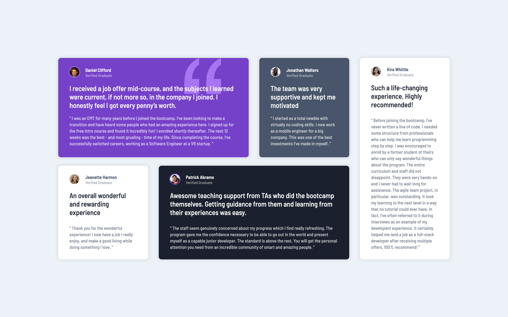

# Frontend Mentor - Testimonials grid section solution

This is a solution to the [Testimonials grid section challenge on Frontend Mentor](https://www.frontendmentor.io/challenges/testimonials-grid-section-Nnw6J7Un7). Frontend Mentor challenges help you improve your coding skills by building realistic projects.

## Table of contents

- [Overview](#overview)
  - [The challenge](#the-challenge)
  - [Screenshot](#screenshot)
  - [Links](#links)
- [My process](#my-process)
  - [Built with](#built-with)
  - [What I learned](#what-i-learned)
  - [Continued development](#continued-development)
  - [Useful resources](#useful-resources)
- [Author](#author)

## Overview

### The challenge

Users should be able to:

- View the optimal layout for the site depending on their device's screen size

### Screenshot

|  Mobile designed at 375px:   |  Desktop designed at 1440px:  |
| :--------------------------: | :---------------------------: |
|  |  |

### Links

- Solution URL: [https://github.com/elisilk/blog-preview-card-main](https://github.com/elisilk/blog-preview-card-main)
- Live Site URL: [https://elisilk.github.io/blog-preview-card-main/](https://elisilk.github.io/blog-preview-card-main/)

## My process

### Built with

- Semantic HTML5 markup
- CSS custom properties
- Flexbox
- CSS Grid
- Mobile-first workflow

### What I learned

- [Background position](https://developer.mozilla.org/en-US/docs/Web/CSS/background-position) - For the one card, there is a background image, so I needed to clarify how to get it positioned correctly, at the top of the container and most of the way toward the right (90%). Of course, I still want to have a background color and I don't want the image to repeat so have to put those in the [background shorthand](https://developer.mozilla.org/en-US/docs/Web/CSS/background) as well.
- BEM
- Fonts
- Grid
- Box shaddow
- Card components
- [Applying opacity to a CSS color variable](https://stackoverflow.com/questions/40010597/how-do-i-apply-opacity-to-a-css-color-variable) - A great explanation and example of how CSS vars can be used to combine an RGB with an alpha value. "The magic lies in the fact that the values of custom properties are substituted as is when replacing var() references in a property value, before that property's value is computed."

### Continued development

- Hmm 🤔

### Useful resources

- [MDN Web Docs](https://developer.mozilla.org/en-US/docs/Web) - Of course, as always. So useful.

## Author

- Website - [Eli Silk](https://github.com/elisilk)
- Frontend Mentor - [@elisilk](https://www.frontendmentor.io/profile/elisilk)
